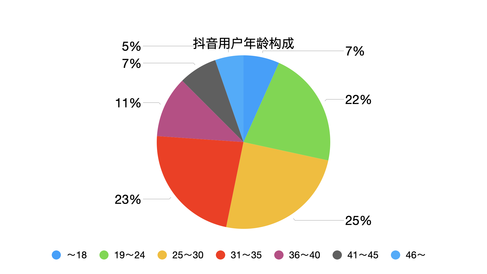
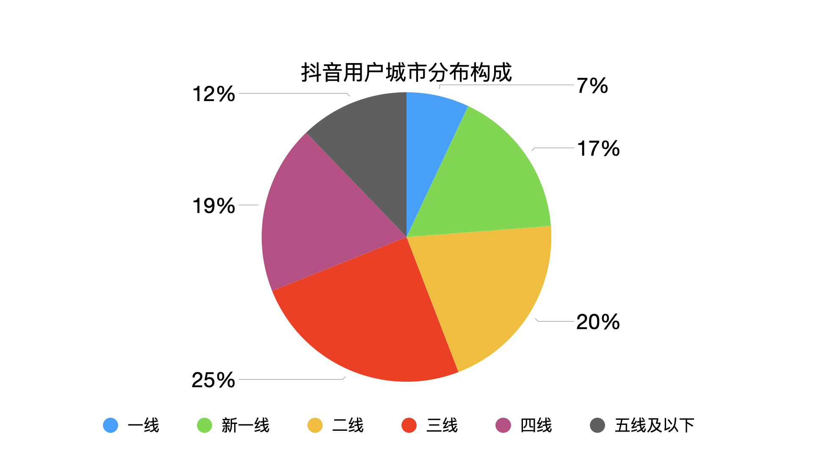

### 概述

本文不是对微信视频号目前的产品形态进行分析，而是对微信视频号可能的产品形式、推荐算法、交互设计方面做了一些分析和设计。同时也部分结合目前微信视频号的产品形态与抖音产品进行了一些对比与分析。

---

### 行业概述
<!--结合产品所在行业，介绍互联网背景（可以展现大局观、战略思维，如果不清晰就不写）-->

为什么抖音快手会威胁到微信的产品系列？

中国网民平均日上网时常约为6小时，用户在平台 社区 应用的活跃度具有零和性，聊天、社交、游戏、视频、网购、学习，时间的分配必定是非此即彼，此消彼长。因此短期内微信的聊天和社交功能不会有立即被取代的风险，但是其他产品诸如游戏、长视频领域会被严重挤压生存空间。

腾讯对标短视频领域也推出了微视，借助QQ的社交网络推广，在QQ内也放上了微视的入口引流。数据庞大的QQ用户为微视带来的流量红利是其他短视频小平台无法企及的，但是在行业另外两个独角兽抖音快手面前，并不足以构成竞争力，只能理解为微视是腾讯做出的短视频产品领域的防守布置，将部分QQ用户留存在自家的短视频产品中，而吸引新的流量和用户方面，作为进攻性的产品去争夺用户微视做不到。究其原因，仍然是抖音快手的先发优势，市场占有率已经遥遥领先,而流失了大量活跃用户到微信的QQ原本就因为自身冗余繁杂的产品形态并不适合轻装上阵去作为争夺短视频市场的主阵地。已经有成熟的粉丝群体和完善的变现方案的内容创作者们也不会舍弃抖音快手的平台转而求其他，最理想的选择可能仅仅只是将微视作为次要的附属平台，在发布内容到抖音快手时顺便发布到微视。这样并不能为微视带来不一样的独特内容和竞争力，而一旦微视平台不能为内容创作者们带来新的不重叠的粉丝和流量，这些内容创作者又会很快的将主要发布和互动的战场回归。

<!--介绍产品对应市场情况（市场规模、用户群体、产品组成及竞争情况、有何新趋势等）-->

---

### 产品概述与定位
<!--产品简单描述（可以按照why,what,where,when,who,how,how much的5W2H的思路来选择性简单描述）-->

<!--产品定位与目标（定位：不是你对产品做的事，而是你对预期客户要做的事。换句话说，你要在预期客户的头脑里给产品定位，它的基本概念应包括在合适的环境中和合适的时间对合适的人说合适的话-即满足合适的需求；目标：实现什么效果）-->

<!--产品形态（比如在终端类型、用户种类等等方面有多种已有的产品形式，为后面延伸思考还可以有哪些形式，或者已有形式之间的整合精简或者形成闭环等）-->

<!--产品发展规划（产品的远景目标以及实施的战略过程。可以细写到产品各类别结构规划及定位，产品生命周期规划等）-->
PUGC (Professional User Generated Content) Bilibili专家生产内容

ARPU(Average Revenue Per User)

MAU DAU (Monthly/dayly active users)

成为新的连接方式，就像Google,Baidu = Search WhatsApp,Wechat = Phonebook & Call.

内容的同质化，创新得不到保护，一个idea被成百上千工作室和个人抄袭。抄袭者很大概率比原创者获得更多的关注。放弃低质化内容领域的竞争，做高质化短视频内容分享平台。抖音，快手被诟病低俗，低智。反向印证了有一个巨大的用户群体，存在着对既能放松一笑打发休息时间又能远离低俗恶趣味的高质量短视频内容的需求。

鼓励和营造高质量短视频平台，但同时也包容其他内容的存在。

---

### 用户需求分析
<!--用户分析（用户地域分布、用户人群分布：性别、年龄、职业、学历等、用户使用客观场合和主观场景，这里个人觉得使用场景和使用所处的客观场合的分析很重要，可以保证你在思考的过程不脱离用户本身）-->

微信具有的熟人社交属性，它并不是完全意义上的虚拟网络社交，而是具有一定的现实社交属性的。从而决定用户趋向分享的内容也是具有现实属性和常规易被接受属性的。短视频附带的部分文化属性（恶搞、低俗、吸眼球、离经叛道）绝大多数并不适合在微信朋友圈分享和传播。就作者本人而言，可以理解和包容被人诟病的许多短视频文化，甚至乐见于文化多样性的表达，例如鬼畜喊麦cosplay等年轻人中流行的文化表现形式，但是要将某些短视频分享到朋友圈也会受到约束和局限。

<!--需求分析（需求整理罗列，然后整理哪些被很好满足，哪些被很坏满足，哪些可以更好满足）-->

__互联网的原始痛点是人的孤独之心__

只要用户仍然感到孤独，那么下一次技术、产品、交互的革新就一定会到来。

1. 社交：user–friends
2. 短视频：user–V–f
3. 直播：user–v–fans
4. ？以优质的内容创作者为点，以该创作者的微信朋友群体为簇，以积累的粉丝为环绕。向用户网中其他的用户进行分享和传播。

版权与创意保护

横向比较
纵向比较

---

### 产品功能设计分析
<!--功能模块框架及简单描述、主要业务流程，产品界面布局交互等）-->

#### 浏览模块：

去掉完全屏蔽一个人的功能。

对动态内容进行个性化推荐。

疲于应付礼节性的社交礼仪。

当用户发布动态内容后，分析这条动态的一些feature属性。初始状态时所有人都可以看见这条内容。

当有朋友评论后，如果用户对评论内容不喜欢，可以点选设置，降低这个朋友与动态feature的相关性，

朋友在他的朋友圈看到用户的动态内容后，点击“在看”表达关注，以及表示期待类似这种内容的态度，那么以后用户再发表类似内容的时候，这个朋友就可以在他的朋友圈看到用户新的相关内容。如果这个朋友对用户发布的内容不感兴趣，可以点击”无感“。对应这个视频feature的权重就会下降，当用户再次发布类似feature动态时，这个朋友很可能就会因为feature对应的权值太小而不会看到这条动态。

你的每个朋友能够看见的你的朋友圈内容是不一样的，针对个性化进行展示。

朋友主动点进我的朋友圈内容列表时，有两个切换，一个是显示”我可以看到的“，另一个显示”全部动态“（用户也可以设置不开放全部动态）（顺便diss一下微信的三天内容可见，无异于产品自杀行为。社交产品内容为主，内容不可见？）。

优点：
1，避免先入为主的刻板印象，例如，觉得我的某个朋友不喜欢我晒到处旅行游玩的照片而屏蔽她，或者干脆就不发动态了。但实际的表现结果，可能我发出来，她会非常感兴趣和喜爱。
2，不需要设置，将真正感兴趣的内容进行展示，将朋友们觉得没有价值意义的内容进行隐藏。例如，我发布的风景照片朋友们都可以看到，而发布的广告微商信息自动的不会呈现在朋友的朋友圈中。

Feature的创建，从内容划分：记录，分享，展示，（positive）炫耀，虚荣心，民粹，反智，煽动,编造假新闻,谣言（negative），。。。

#### 剪辑发布模块：

1. 替代手机底层应用 

更便捷，简洁，高效，自动保存的内容创作工具。将微信短视频剪辑发布模块做成替代手机底层相机应用的一个入口选择。拍摄的过程完成初步的粗剪辑，将半成品作品展示给用户，用户进行可选择的设置。

2. 自动AI成片
	
	智能手机越来越强大的数据存储能力，使用户拍摄照片视频也越来越简单和频繁，这方便了用户记录生活的同时也造成了新的问题--dirty data。一次旅行、一场活动完成，留下几百甚至上千张照片，删除次片和保留良片成为一个费时费力的工作。好的解决方案是，利用AI技术，在几百上千张照片中，去除拍摄角度不好，光线不好(背光黑色，夜拍沙粒感)人物仪态不好(闭眼，五官变形等)的照片，重复系列照多选一进行保留。自动保留美感较好的素材原片。

	AI选出相似的照片，每一个相似照片组内有多张照片。它们的光线，噪音，水平线，清晰度，等等有差异。用户初始时在系列中进行选择，每个系列留下一张，这是一个cold start的学习训练过程，记录用户的偏好数据。训练一定数量后就可以开始自动为用户清理照片。清理功能将随着用户的累积使用越来越精确。

	多余照片保存在云端，用户可以手动人工确认删除。对最终保留下的素材进行自动微ps处理，美白，亮光，模糊，降噪，锐度。套用短视频模版自动生成粗剪版作品。

	

3. 自动保存和快速加载

微信的其他功能对视频号功能的影响需要被考虑到。短视频的浏览和制作发布存在较高的被迫中断可能性，用户有随时退出视频号使用其他微信功能的需求，例如使用聊天通讯、扫码、支付等功能。因此短视频浏览和创作发布的进度需要随时快速的自动保存和重新进入时的快速加载。

---

### 产品体验分析

-

#### 交互

1. 播放与暂停

	抖音：自动播放，单击暂停，循环播放直至滑动到下一个视频
	
	微信视频号：自动播放，无法暂停，不用点击操作，循环播放直至滑动到下一个视频
	
	两者的交互逻辑都是利用短视频时长短的特性，用户对快速切换不同视频的需求高于手动暂停和播放的需求，因此尽量的减少用户在点击上的耗时，意味着更多的短视频被播放的机会。短视频的时长短意味着高潮内容同样的短，用户对重复播放的需求远高于长视频，所以设计了自动循环播放的交互方式。
	
2. 点赞
3. 评论
4. 转发

-

#### UI

---

### 竞品分析

#### 抖音的优势

1. 先发优势，市场占有率

	成熟的由内容创作者和用户构成的短视频产品生态，先发优势创造的趋近饱和的市场占有率。

2. AI推荐算法

	

3. 交互简洁（傻瓜模式）拍摄剪辑功能对用户的友好性，是对之前其他视频平台相关剪辑制作功能的颠覆，注重视频与音乐节奏的搭配，丰富的特效模版库，强大的剪辑工具（视频滤镜、变声、自动字幕等）。

##### 抖音的短视频内容构成

1. 个人生活向
2. 段子 笑话 梗翻拍
3. 全民模仿类
4. 影视作品二次创作（精彩片段重配乐、剪辑解说）
5. 有故事情节的专业创作

#### 微信短视频的潜在优势

1. 版权保护
	
	版权保护对有创意才华的初创者友好。将类似微信公众号的文章版权保护机制引入到视频版权领域。根据用户短视频上传时间等信息和用户自己的版权声明进行版权归属判定，保护创意和创作，作者拥有在作品中添加“原创”标签的权利，对于完全抄袭翻拍的内容进行屏蔽和减少曝光。但是保护版权的同时，也鼓励更多的创作者获得创意授权后进行二次创作，减少同质化内容的同时激发真正做优质内容创作的作者的灵感和创新积极性。
	
	抖音在版权保护问题方面要面对的挑战更大，因为已经存在的大量同质化抄袭作品就是摆在抖音面前的首要问题。长期面对同质化抄袭内容必然让用户产生审美疲劳和滋生厌恶情绪，对平台内容的创作环境造成不利影响。简单的复审核与屏蔽无疑是对既得利益的抄袭创作者的利益损害，无异于自断其臂。微信视频号内测了较长时间，腾讯暂时没有投入资源来推广，应该是急于找到合适的产品形式与核心竞争力后再做推广的考虑。那么版权保护方面，微信视频号就具有了后发优势。在国内人均教育层次逐步提升，版权保护成为社会主流价值观的大背景下，注重版权的产品，将会获得更多的支持和使用。
	
2. 更高潜在分享因子
	
	对于没有前期粉丝的个人内容创作者，微信朋友圈是一个很优质的分享传播媒介，适合真正有创意有吸引力的内容得到快速传播。另一方面，微信朋友圈附加的熟人社交属性对短视频内容的分享转发传播具有额外的初始加速和加成作用。举例来说，同样拍摄的风景视频内容，在需要猎奇、吸引眼球的抖音上可能用户并没有动力去分享它，但如果是微信朋友圈中用户的朋友拍摄的，那么用户将会有额外的分享动力去转发评论和传播。这样的内容传播环境，也能促使创作者们不对博出位吸眼球的低俗方式趋之若鹜。
	
3. 社交壁垒

	如果说B站之于抖音快手筑起的是文化壁垒，那么微信朋友圈筑起的就是即时通讯和熟人社交壁垒。腾讯作为坐拥QQ、微信两大社交平台的互联网巨头，熟人社交既是防守的盾，也可以是短视频领域发力中进攻的矛。
	
	有一个寻找天使轮的创业者常被VC灵魂发问的问题：OK，你的idea很好，那如果BAT也做一个一样的，你怎么办？虽然互联网新技术的快速变革带来的新机遇使这样的情况发生了某种程度上的改变，但从另一个角度来考虑，腾讯也许是目前唯一有较大机会在短视频领域实现对抖快后发制人弯道超车的存在，而其中至关重要的一点就是腾讯产品拥有的先天社交基因。微视在QQ平台证明了简单的模仿抖音产品形态的道路永远无法实现超越，那么摆在微信团队面前的问题就是，如何让11.12亿用户（2019年一季度数据）每日点击微信发布按钮后在文字、图片、原生视频之外选择那个多出来的“短视频”选项来进行创作和发布。
	
4. 有用户的历史动态数据

	可以对用户的历史动态数据，进行自动的视频模版套用快捷生成短视频内容。既可解决初期短视频内容创作素材的来源问题，又可以利用怀旧向的情怀进行推广形成传播效应。

### SWOT分析
* Strengths 
<!--（需求满足、交互、视觉、技术性能、资源平台等方面分析用户体验，可以结合竞品来考虑）-->
* Weaknesses
* Opportunities 
<!--新产品，新市场，新需求，市场发展趋势优势，竞争对手失误等）-->
* Threats 
<!--新的竞争对手，市场挑战，替代产品，行业政策，用户不稳定或改变，突发风险事件等）-->

### 改善建议及发展方向
<!--改善建议：可针对上面提出的劣势或者功能、非功能分析提出具体的改进思路或方案，如果能有交互设计更好-->

<!--发展方向：可借鉴第六个模块的SWOT分析，见下图（分析完了还是做个总结得出结论，要不然分析有些浪费-下图红色字体部分）-->

Thanks for your valuable help
依托于微信做短视频，还是完全独立，从0到1重新做一个短视频平台？类似微信之于QQ。

微信朋友圈是现实熟人社交圈的延续和扩充。和短视频这种需要非熟人粉丝传播的需求是矛盾冲突的。

微信视频号优势：有用户以前的视频照片内容，可以做快速的短视频内容制作。

社交属性优势

积存照片视频内容处理，简洁交互，减少选择步骤，避免用户中途中断交互后重新开始的成本

抖音与微信的竞争关系分析

在微信开辟视频号战场，还是像微信之于QQ一样，完全推倒重来？这是个问题

专业化，高端化短视频作品

制造鄙视链，赋予产品额外精神层面的使用价值。

避免恶俗，和音频伴奏的审美疲劳

用户留存，刷短视频，获得段子笑话带来的乐趣之后，产品的其他价值如何提现？

弹幕功能，

### Reference

- [1] [视频战争2020](http://www.woshipm.com/it/3335524.html)